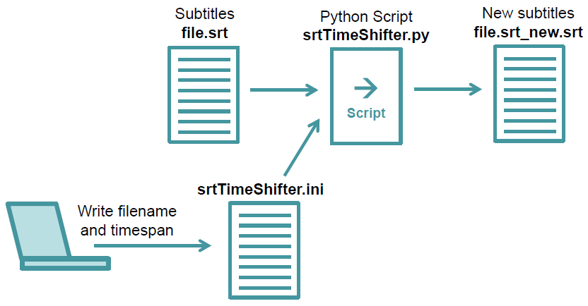

# SRT-time-shifter

These very simple Python scripts shift all the times in a SRT subtitle file.

Say, you have a mediafile (a video or an audio file) with subtitles. The subtitles are stored in a separate subtitle file - a textfile in SRT format. Imagine, the time values in the subtitle file need to be shifted, to be accurate.

Here are are two python scripts. The first script helps you to shift all time values by a constant time. The second script shifts times in a way, that they fit at the beginning and the end of the mediafile. This is useful in the case, that the the media file runs at a slightly different speed as expected by the creator of the subtitles file.

## srtTimeShifter.py

Do you want to shift all subtitle times by a constant time span? Than write the name of the subtitle file and the time span into the file srtTimeShifter.ini. 

Next, run the script srtTimeShifter.py. The script reads the subtitle file and outputs a new subtitle file with the new times.

The whole process is shown in this Data Processing Map:

Here is an example of the srtTimeShifter.ini file:

inputFileName = "file.srt"

addSeconds = -3.435

## srtTimeCorrector.py

Do you want to shift all subtitle times in a way, that they fit to a media file, that runs at a sligtly different speed? Than write the name of the subtitle file srtTimeCorrector.ini. Add a pair of times (old, new time) from the beginning of the media file. And add a pair of times (old, new time) from the end of the media file.

Next, run the script srtTimeCorrector.py. The script reads the subtitle file and outputs a new subtitle file with the new times.

The Data Processing Map of this process is similar to the Data Processing Map above.

Here is an example of the srtTimeCorrector.ini file:

inputFileName = "file.srt"

time1oldInSRT = 00:00:15.700

time1inVideo  = 00:00:20.100

time2oldInSRT = 01:20:58.500

time2inVideo  = 01:17:54.200

