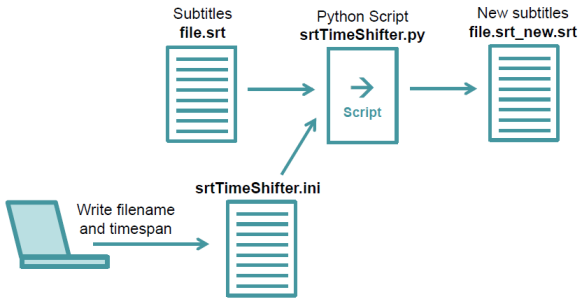

# SRT-time-shifter
This very simple Python script shifts all the times in a SRT subtitle file by a given constant value.

Here is how do you use the Python script. Let's say, you have subtitles of a mediafile in the SRT format. And you want to shift all subtitle times by a certain time. Than write the name of the SRT file and the time into the file srtTimeShifter.ini. Than start the script srtTimeShifter.py. It will give you a new subtitle file. The whole process is shown in this Data Processing Map:

Here is an example of the srtTimeShifter.ini file:

inputFileName = "file.srt"

addSeconds = -3.435
